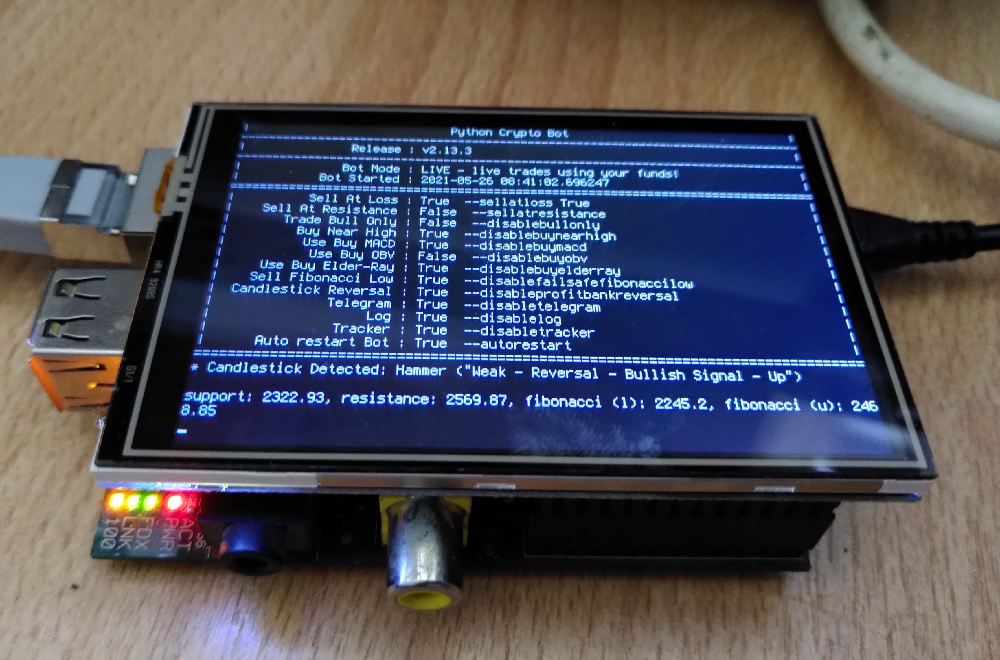

# Installing pycryptobot on a Raspberry Pi



I recently came across [pycryptobot](https://github.com/whittlem/pycryptobot), a Python-based crypto trading bot. I didn’t want to have my laptop open indefinitely with the bot running, nor did I want to bother with setting up a cloud computer with Docker, so I went to install it on the old Raspberry Pi I had lying around. While I also own a RPi 3, I made it a point to install the bot on the old, almost first generation RPi B+, which is the slowest computer I can currently imagine, for chuckles. I also happen to have a 3.5" display for the Pi which I never used for anything, so I’ll set it up as well and have it display the bot’s output. This tutorial assumes that you have *some* form of display being attached to the Pi, be it a normal HDMI display.

The *pycryptobot* repo says that it requires Python 3.9, but I found that it runs fine on the Python 3.7 that currently ships with Raspberry Pi OS. The installation procedure for the Pi differs a bit from what’s described over at *pycryptobot*’s repo, which is why I made this tutorial.

Here’s a turn-by-turn navigation for how to set it up.

# Operating System

For a headless or command-line-only Pi bot, download the latest `Raspberry Pi OS Lite` image from [here](https://www.raspberrypi.org/software/operating-systems/).

Follow [these instructions](https://www.raspberrypi.org/documentation/installation/installing-images/mac.md) for how to copy the OS image to the SD card. *(I’m using a Mac, but there are other sites out there describing the same process for other host OSs.)*

After the copying process is done, the image will be mounted into my macOS. *(If not, eject the card and re-insert it for it to mount.)* Open the `boot` partition in the Finder and create a file called `ssh`. I do that by duplicating the next best *.txt* file I can find and rename it so `ssh`. The file’s content won’t matter. This will enable the SSH server on the Pi right from the first boot, so you can log in via a terminal, as my Pi is headless and only connected to the network via an Ethernet cable. If you have a keyboard connected, you may skip this step.

Stick the SD card into the Pi, connect the Ethernet cable to your router, and power it up. Then, after giving it a minute or two to boot (my little display’s drivers aren’t installed yet, so I’m still running headless), open a Terminal and log into the Pi with `ssh pi@raspberrypi`. _(My router’s name server already knows about the Pi, so using its network name here. Otherwise, you need to find out your Pi’s IP address if obtained via DHCP, via your router’s admin interface, then replace `raspberrypi` in the **ssh** command with its IP address.)_ Log in with the default password `raspberry`. You may care to change the password, but I don’t, as I’m in a trustworthy home network.

# Installing Software

First, update the distro’s package registry and all packages to their newest version with `sudo apt update && sudo apt upgrade`.

Next up, install *git* and *pip* (Python’s module registry) with `sudo apt-get install git python3-pip`.

Download *pycryptobot* with `git clone https://github.com/whittlem/pycryptobot`, then *cd* into the new folder with `cd pycryptobot`. The original repo now says to install the required Python modules using *pip*. Don’t do that just yet. The problem is that this crashes on the Pi, as some of the modules need to be compiled from their sources during the installation for the Pi’s ARM processor. This is terribly slow (could take days on the old Pi), and also simply errors out for me. So for now, let’s take a look at the requirements with `cat requirements.txt`, which at the time of this writing looks like this:

```
urllib3==1.25.11
pandas==1.1.4
requests==2.25.0
statsmodels==0.12.1
matplotlib==3.3.3
binance==0.3
python-binance==0.7.9
mock==4.0.3
pytest==6.2.2
pytest-mock==3.6.1
```

The author chose to lock the requirements to specific module versions, many of which are alreay outdated. We will ignore the specific versions for now and go for the latest.

We install all those packages that require the heavy and erroneous compiling by choosing packages provided by the Raspberry Pi OS distribution directly, which contain pre-compiled binaries. Notably, these are *pandas* and *matplotlib*, which should also cover *numpy* and *scipy* in dependencies. The command to use is `sudo apt-get install python3-pandas python3-matplotlib`.

Then we install the remaining Python modules with Python’s own package manager (ignoring the version numbers from *requirements.txt*): `pip3 install urllib3 requests statsmodels binance python-binance mock pytest pytest-mock`. _(Make sure that the requirements haven’t changed since I wrote this, or adjust accordingly so that we’re not missing anything)_ You will see that a few of those modules have by now already been installed through the previous step, so they are automatically skipped here. I’m leaving them in the command above for completeness. This will still need to compile a few of those packages from sources, but it doesn’t error out for me, so it’s fine.

# pycryptobot Configuration

Now that we have installed everything, we can give *pycryptobot* a try. I create my config file with `nano config.json`, copying my config in there, then saving with `Ctrl-O` + `Enter` + `Ctrl-X`, then running the bot with `python3 pycryptobot.py`.

It runs fine, except it’s of course a bit slower to start. You can monitor the CPU using `top` in a separate session and will find that it’s not consuming any CPU resource while idling, and crunching away on the numbers just fine when it needs to — which makes this old Pi the perfect host for this application.

If your setup is truly headless without a screen, you need to find a way to run the bot on startup, which probably involves starting it as a daemon with a trailing `&` at the command. I won’t go into that, because I’m using a screen.

# The Screen

This section is for setting up the 3.5" screen for the Pi, so you can skip this if you have a normal HDMI-connected screen or no screen at all.

I installed the driver and set it up using [this page](http://www.lcdwiki.com/3.5inch_RPi_Display). You can ignore error message about the *xserver*, which isn’t installed. Also consider rotating the screen as per that page’s information.

# Running pycryptobot on boot

In order to see the bot’s output on our screen, we need to log in automatically on boot and run a script.

Also, I want the bot to run in an infinite loop in a shell script. This way the bot will restart in case of a failure. The bot does contain error handling through the `autorestart` option, but it’s not unthinkable for it to crash silently and then needs to be restarted by an external process.

Also, there needs to be a way to restart the bot manually in case of updates to *pycryptobot* (which happen frequently), or you wanting to change your configuration. The problem is that you can’t remotely bump into an open terminal session and quit and restart the running application. You can do that with an attached keyboard, but not remotely. However, you can remotely find and kill the Python process responsible for running *pycryptobot*, upon which it will (in my setup) pull the latest sources, and restart with my latest configuration. 

So given the `git pull` being part of the infinite loop, I prefer to run the bot without the `autorestart` option. If it crashes, there’s a chance that that crash has already been fixed in the source in the meantime, so a crash will trigger a source update and then a restart, which is awesome.

Let’s go step by step.

Create a file called *loop.sh* with `nano loop.sh` and paste the below code in it. This is the shell script that pulls the updates and runs the bot indefinitely.

```
#!/bin/bash
while true; do
    git pull
    python3 pycryptobot.py
done
```

Change its permissions to be executable with `chmod 755 loop.sh`.

Following [this tutorial](https://www.raspberrypi-spy.co.uk/2015/02/how-to-autorun-a-python-script-on-raspberry-pi-boot/), we set the Pi to log into the `pi` user account automatically on startup: Run `sudo raspi-config` to open the Pi’s config editor, choose `1 - System Options`, then `S5 Boot / Auto Login`, then `B2 Console Autologin`, then quit. The reboot can wait until later.

Open the startup controller script with `nano ~/.profile`, then at the end of the file, place the following code, save and quit:

```
if pgrep loop.sh; then
    echo "loop.sh is already running; do nothing."
else
    cd pycryptobot
    /home/pi/pycryptobot/loop.sh
fi
```

Restart the Pi with `sudo reboot`. It logs in now and runs the bot.

Now, if you want to remotely restart the bot in your screen’s terminal session, you log in remotely with *ssh*, then do ``kill `pgrep python` `` (assuming it’s the only Python instance that’s currently running). In case you want to kill the loop itself, use ``kill `pgrep loop.sh` ``.

# Terminal Font Size

I found the text on my little screen to be too big, so I follow [this tutorial](https://www.raspberrypi-spy.co.uk/2014/04/how-to-change-the-command-line-font-size/) to decrease it:

Open `sudo nano /etc/default/console-setup`.

Then change the font settings to 

```
FONTFACE="Terminus"
FONTSIZE="6x12"
```

and reboot with `sudo reboot`.

# Limitations

This tutorial assumes that you only want to run one instance of *pycryptobot*, because I only have one screen, so can only run once. Other measures may be necessary to run multiple instances for different markets, but I haven’t figured them out. This is your turn.

# Due Diligence

When considering crypto trading, please do us all a favour and consider the environment around you alongside the dollar signs in your eyes. Personally, I got into crypto trading just a few days ago after reading the announcement that Ethereum will switch from PoW to PoS within the year (2021), which requires 99.95% less energy to validate compared to PoW (like Bitcoin). Please choose your investments wisely. I vow to only trade PoS currencies, or in case of ETH, once that will make the switch in the near future.